import YouTube from '@site/src/components/YouTube';

# Steam Advanced Sessions Setup

This guide covers how set up the **Advanced Sessions Plugin** to allow you to play with friends over Steam using **Blueprints only**.

<!-- truncate -->

:::note
This article assumes you already know the basics of Unreal Engine. It does not cover setting up UI or levels to keep the content focused. Future guides will cover these topics — stay tuned!
:::

<YouTube id="5nMKEKV0acI" title="Steam Integration in Unreal Engine" />

## 🧩 Advanced Sessions Setup

1. Download the [**Advanced Sessions plugin**](https://vreue4.com/advanced-sessions-binaries) version that matches your Unreal Engine version.
2. **Create or open your Unreal Project**.
   - The project must be a **C++ project**.
   - If you're using a Blueprint-only project, you can convert it to a C++ project by creating an **empty C++ class** at the top of the editor by going to **Tools -> New C++ Class**
     - In the window that opens, click next, then Create Class.
       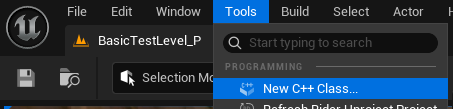
3. **Copy plugin files**:
   - Copy the `AdvancedSteamSessions` and `AdvancedSessions` folders from the plugin download into your project folder's `/Plugins` folder.
     - If the `Plugins` folder doesn’t exist, create it.
4. **Edit config**:

   - Open your project's `DefaultEngine.ini` file inside the `Config` folder and add the following to the bottom of the file and save:

   ```ini
   [/Script/Engine.GameEngine]
   +NetDriverDefinitions=(DefName="GameNetDriver",DriverClassName="OnlineSubsystemSteam.SteamNetDriver",DriverClassNameFallback="OnlineSubsystemUtils.IpNetDriver")

   [OnlineSubsystem]
   DefaultPlatformService=Steam

   [OnlineSubsystemSteam]
   bEnabled=true
   SteamDevAppId=480

   [/Script/OnlineSubsystemSteam.SteamNetDriver]
   NetConnectionClassName="OnlineSubsystemSteam.SteamNetConnection"
   ```

   This config change does the following:

   - Tells Unreal to use Steam’s networking driver (`SteamNetDriver`) by default, falling back to IP networking (`IpNetDriver`) if Steam isn’t available.
   - Sets Steam as the default platform for online services.
     - All networking features (sessions, matchmaking, friends, etc.) will use Steam's systems.
   - `bEnabled=true`: Activates the Steam Online Subsystem.
   - `SteamDevAppId=480`: Uses the Spacewar test app (ID: 480) for development.
     - This is Valve’s default app ID for testing multiplayer with Steam.
   - Ensures that peer-to-peer connections use Steam rather than raw IP sockets.

5. **Add `steam_appid.txt`**:

   - In the **root folder** of your project, create a file called `steam_appid.txt`.
   - It should contain a single line:

     ```
     480
     ```

     :::info
     The `steam_appid.txt` file is only required during development to tell your application what Steam AppID to use when integrating with the Steam API. When your game is launched through Steam (rather than from your local file system), the Steam client automatically provides the AppID, so this file isn't required in shipping builds.
     :::

6. **Test Steam overlay**:

   - Launch a **standalone** game from the editor.
   - The Steam overlay (Shift + Tab) should now appear.
   - You may need to **restart the editor** to properly import the plugins and enable overlay functionality.

   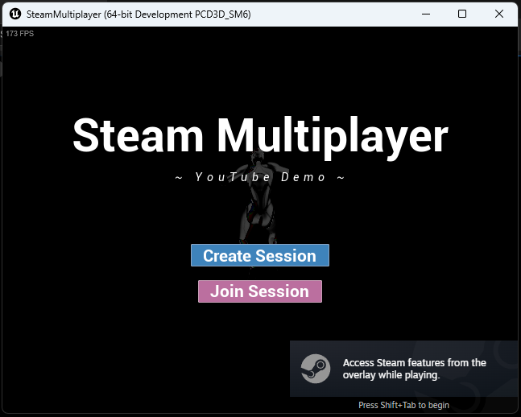

---

## 🔧 Session Creation and Joining

1. **Create a Game Instance**:
   While the Advanced Sessions functionality can be called from any blueprints, it's typically best to call from within a game instance, as this is always globally available and exists for the entire lifetime our game is running.

   - Create a Blueprint class inheriting from `AdvancedFriendsGameInstance` called `BP_GameInstance`.

   :::info
   The `AdvancedFriendsGameInstance` is a child of the standard `GameInstance` class provided by the Advanced Sessions plugin. It provides several pre-defined delegate functions for friend-related events such as:

   - OnPlayerLoginChanged
   - OnSessionInviteReceived
   - OnSessionInviteAccepted
   - And many more...

   <br/>
   as well as setting up several other systems for tracking friend-related behaviour. As such, it's highly recommended that you use it in your project if possible.
   :::

2. **Create two events inside BP_GameInstance**:

   - **Create Session**:
     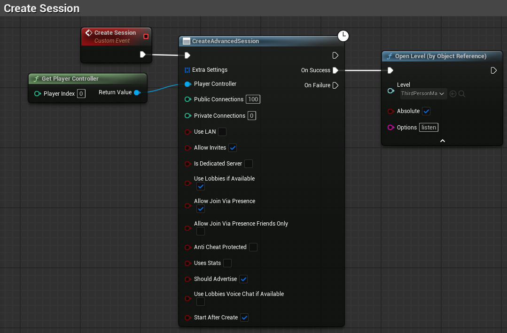

     - Use the `Create Advanced Session` node to create a session.
     - Make sure the **Player Controller** is connected.
     - `OnSuccess` use `Open Level` with `listen` added to the Options parameter

   - **Join Session (via invite)**:
     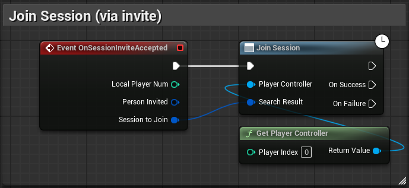
     - Use `OnSessionInviteAccepted` to respond to friends accepting game invites (this is only available when using the `AdvancedFriendsGameInstance` or a subclass of it).
     - Use `Join Session` node, being sure to pass in the `Player Controller` and `Session to Join`.

3. **Create a menu widget**:

   This guide doesn't cover how to make UI or have it appear on the users screen.
   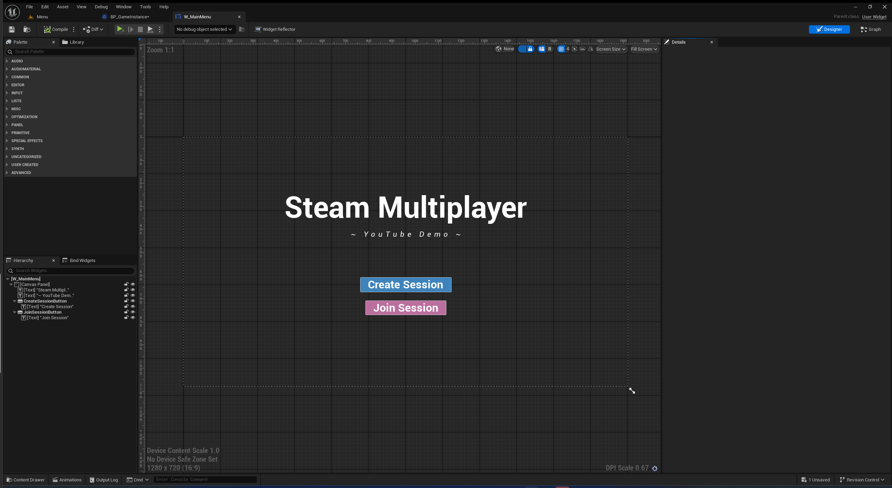

   - Add buttons and blueprint logic for:

     - **Creating a Session**
       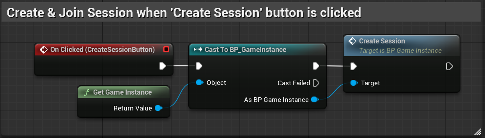
     - **Finding and Joining a Session**

       - The below blueprint is a very simple and naive way of joining the first session found. In practice, you should return the array of results from `FindSessionsAdvanced` and display these in a server browser UI.
         :::warning
         Be sure to connect the `Player Controller` and increase the `Max Results` from it's default of 0 for the `FindAdvancedSessions` node.
         :::
         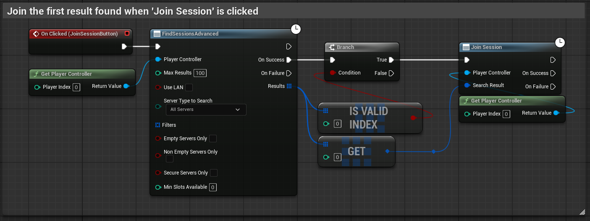

4. **Set GameInstance**:
   - Go to **Project Settings → Maps & Modes**.
   - Set the default GameInstance class to your `BP_GameInstance`.
     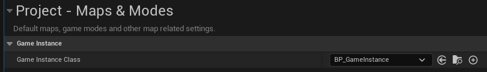

---

## 🧪 Testing Multiplayer in the Editor

1. In the **play dropdown** (next to the play button), set:
   - **Number of Players**: `2`
   - **Net Mode**: `Play As Listen Server`
2. Press **Play**.
   - Two windows will open.
   - Create a session in one and join from the other.

:::tip
This is still **local** testing and does not use Steam. This is useful for testing your multiplayer gameplay code in the editor, but does not validate if your Steam sessions work correctly. To see how to test Steam from a single computer, see [🖥️ Testing Steam Multiplayer Locally](#%EF%B8%8F-testing-steam-multiplayer-locally)
:::

---

## 🖥️ Testing Steam Multiplayer Locally

:::warning
This step is **Windows-only** (although alternative sandboxing tools for other platforms do exist).

- It uses Sandboxie Plus to run two Steam clients simultaneously.
- You'll need two separate Steam accounts.
  :::

### Step 1: Sandboxie Plus

[Download](https://sandboxie-plus.com/downloads/) and install the latest version of Sandboxie Plus.

- Choose your version (`x64`, `ARM`, or `x86`) based on your system:
  - If you're unsure, in Windows go to the Settings app, then `System → About → Device Specifications → System Type` to check.

### Step 2: Build Your Game

In Unreal Engine:

1. Go to **Edit → Project Settings → Maps & Modes**.
2. Ensure you've set the correct **Game Default Map**, typically your main menu level.
3. In the main editor window open the `Platforms` dropdown next to the play controls, `Windows → Package Project` (setting the Binary Configuration as needed) to build your game as a `.exe`.
   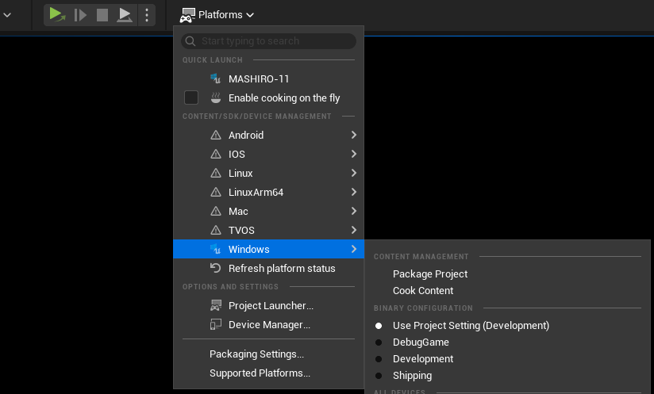

### Step 3: Configure Sandboxie

- Launch Sandboxie and find the default sandbox: `DefaultBox`.
  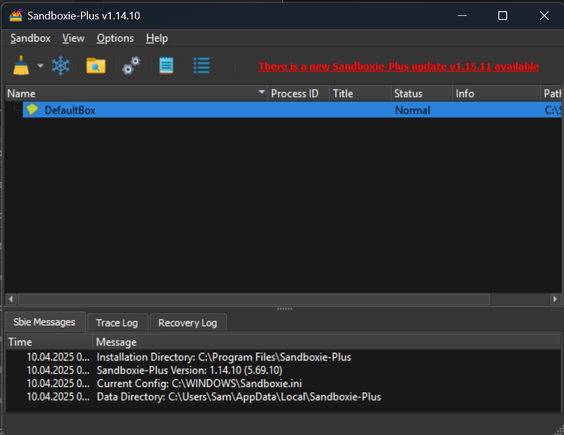
- Right-click → `Sandbox Options` → `General Options → Run Menu (Tab at the top)`.
  - On the right-side of the window, click the dropdown next to `Add program` and select `Browse for Program`
- Add:
  - `Steam.exe` (usually in `C:\Program Files (x86)\Steam`)
  - Your packaged game `.exe`
    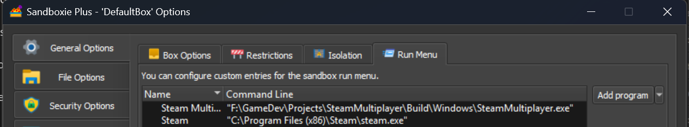

### Step 4: Run Two Instances

- Start Steam normally and log in to your **main** account.
- Start **Sandboxie**, then run Steam in the sandbox and log in to your **second** account.
  :::warning
  If using AppID 480, ensure both your Steam account and the sandboxed account have the same Download Region, which can be set in `Steam settings → Downloads → Download Region`.
  - The test AppID 480 has restrictions that require players to be using the same Download Region, so if these settings differ you will not find the other player's session.
  - When testing with friends online, they will also need to be in the same download region.
  - This limitation only applies to the AppID 480, so if you have your own AppID then this step is irrelevant.
    :::
- Launch your packaged game `.exe` directly and from Sandboxie.

You should now be able to:

- Create a session on one client.
- Find and join the session on the other.

:::note
If Steam doesn't show the overlay in your packaged game, double-check:

- `steam_appid.txt` exists and has `480`
- You're using a **packaged build**, not running in-editor
- Steam is running **before** the game starts
  :::

---

## 🔥 FAQ / Errors

### Unreal Engine

- Unreal Engine versions 5.3 and earlier do not have Online Subsystem Steam enabled by default. You can enable this from the plugins window within the editor _(contributed by [@CallumPooleProgramme](https://www.youtube.com/@CallumPooleProgrammer))_
- The Steam Sockets plugin can cause issues with the Advanced Sessions plugin, so ensure that this is disabled (it is usually off by default in recent engine versions). _(contributed by [@daltoncave112](https://www.youtube.com/@daltoncave112))_

### Sandboxie

- > _When Sandboxie is the host, my client can discover session but can't join. When I host on my regular client, Sandboxie can't find the session._

  This is due to Sandboxie restricting network behaviour. Resolving it requires you to declare a specific port and query port to run the sandboxed game client on. You can do this by:

  - Opening your 'DefaultBox' Options in Sandboxie, `General Options → Run Menu`. In the list of applications you've added, double click on the path (in the command line column) of your client and add the following after the `.exe`:

  ```bash
  --port=27015 --query-port=27016"
  ```

  As a full example, this should look like:

  ```bash
  "F:\GameDev\Projects\SteamMultiplayer\Build\Windows\SteamMultiplayer.exe" --port=27015 --query-port=27016
  ```

  _(contributed by [@Lazaerus](https://www.youtube.com/@Lazaerus), [@mrruzvert](https://www.youtube.com/@mrruzvert))_

## ✅ Done!

You’ve now set up and tested the **Steam Advanced Sessions Plugin** entirely using Blueprints.  
This allows friends to host/join games via the Steam API with no C++ coding required.

---

🧙‍♂️ _– Hanayou, Chronicler of Unreal_

P.S. Want a future guide for matchmaking UI or persistent lobbies? Let me know!
